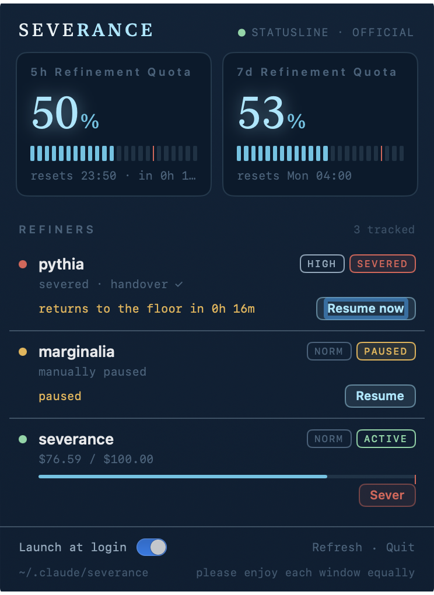

# Severance

**Sever your side-project Claude Code spend from your work spend on a shared Team plan.**

<p align="center">
  
</p>

> Your **outie** works unbudgeted — long sessions on the org's dime.
> Your **innie** gets a hard allowance and a scheduled return to the severed floor.

Severance hard-caps opted-in ("severed") projects on Anthropic's *official*
utilization accounting, has the agent write a handover, stops the session before it
can roll into usage-credit billing, and auto-resumes it in its original tmux pane
when the window resets. A macOS menu bar app shows the gauges and drives resume.

## Features

- **Gates on official `rate_limits`** (5h / 7d utilization), not local token guesses,
  so it keeps working when limits or model weighting change. Falls back to the OAuth
  usage endpoint, then a local `ccusage` estimate — and records which tier it used.
- **Per-project, per-priority budgets** via a priority ladder (critical / high /
  normal / low). Work repos are untouched — installing the plugin is a no-op until a
  repo opts in.
- **Zero-friction resume** — the agent writes its own handover; the session is
  re-injected into its tmux pane at reset (systemd on Linux, the menu bar app on macOS).
- **Preemption** — a high-priority session defends headroom by pausing lower-priority ones.
- **Cost caps** — an optional absolute per-session USD cap, plus a hard trip the moment
  usage credits start burning.
- **macOS menu bar app** — 5h / 7d gauges, per-project status, and Sever / Resume /
  Open-handover actions.
- **All state is plain JSON** under `~/.claude/severance/` — `cat` it, or watch it in the app.

## Install

**Plugin** (Linux + macOS):

```text
/plugin marketplace add gruesomeparty/severance
/plugin install severance@severance
```

**Menu bar app** (macOS 14+):

```sh
brew install --cask gruesomeparty/tap/severance   # ad-hoc signed: add --no-quarantine
```

Or grab `Severance-macos.zip` from [Releases](https://github.com/gruesomeparty/severance/releases)
(`xattr -dr com.apple.quarantine Severance.app && open Severance.app`), or build from
source: `cd apps/menubar && bash scripts/bundle-app.sh`.

## Configure

Ask Claude *"set up severance for this repo"* (the bundled `configuring-severance`
skill does it), or by hand in a project's `.claude/settings.json`:

```json
{ "env": { "SEVERANCE_ENABLED": "1", "SEVERANCE_PRIORITY": "normal" } }
```

Then wire the statusline bridge for the best (Tier-1) signal — see
[docs/INSTALL.md](docs/INSTALL.md) — and add `.severance/` to `.gitignore`.

Common knobs (project `env`): `SEVERANCE_PRIORITY` (critical/high/normal/low),
`SEVERANCE_LIMIT_USD` (per-session cost cap), `SEVERANCE_UTIL_PCT` /
`SEVERANCE_WEEKLY_PCT` (override the ladder), `SEVERANCE_MAX_RESUMES`. Full list and
the ladder defaults: [docs/](docs/).

## Use

- `/severance:severance-status` — live signal tier, 5h / 7d utilization, and per-project state.
- **Menu bar app** — click the icon for the gauges and project rows; Sever / Resume /
  Open-handover per project; a Launch-at-login toggle.
- When a project trips, the agent writes `.severance/handover.md` and stops; it resumes
  automatically at the window reset (or hit **Resume now**).

## Signals — the honest version

- **Tier 1** — official `rate_limits` via the statusline. Best; needs a recent Claude
  Code and a Pro/Max login.
- **Tier 2** — the OAuth usage endpoint. **Undocumented; may be restricted or removed.**
  Degrades silently.
- **Tier 3** — `ccusage`. A local estimate; the gate stays conservative and marks state
  `signal_tier: ccusage`.

Details and verification commands: [docs/SIGNALS.md](docs/SIGNALS.md).

## Roadmap

- [ ] Burn-rate / pace-aware shedding (shed faster burners before slow ones)
- [ ] Linux desktop notifications on sever / resume
- [ ] Per-session state for concurrent same-repo sessions
      ([#15](https://github.com/gruesomeparty/severance/issues/15))

## Contributing

Contributions welcome — see [CONTRIBUTING.md](CONTRIBUTING.md). Architecture and
internals live in [docs/](docs/) ([architecture](docs/ARCHITECTURE.md) ·
[signals](docs/SIGNALS.md) · [install](docs/INSTALL.md)).

## License

[MIT](LICENSE).
